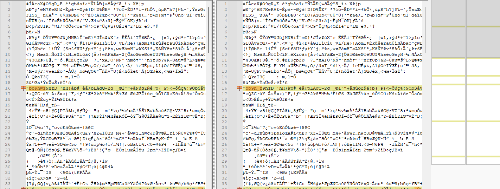
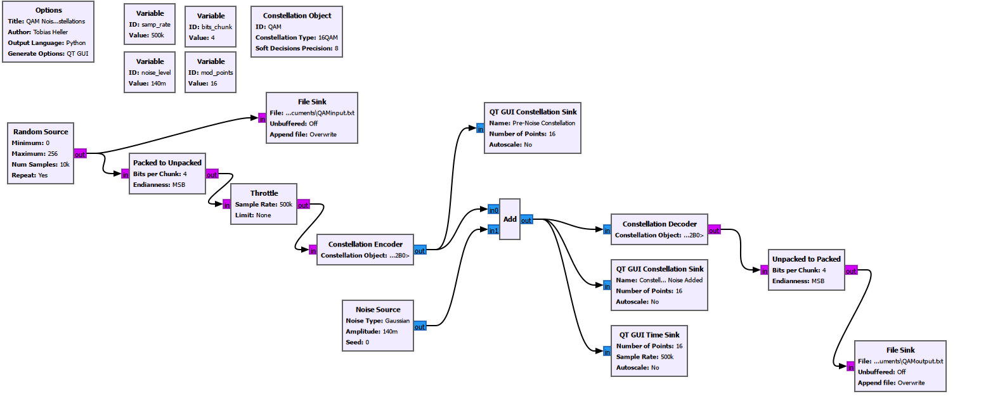

# QAM Noise

QAM Noise simulates quadrature amplitude modulation in GNU Radio Companion, and is designed to be used as a simple teaching tool in a communications systems class. The amount of noise in the communications channel is configurable, and two constellations are provided to visualize the signal with and without noise. The primary simulated mode is 16-QAM, but 8PSK and QPSK are also selectable. Additionally, two text files are generated, one with the transmitted data and one with the received data, which can be compared to calculate the amount of loss in the channel. 

## Initial Assignment Prompt (from ECSE 351 @ CWRU, GNU Radio Problem Set)

Using the QAM Mod and QAM Demod blocks, simulate quadrature amplitude modulation in GNU
Radio. Add or create a visualization of the QAM constellation. (There are some existing blocks for constellation visualization which may help here). Next, add a noise source which is summed with the modulated signal, and visualize the constellation with and without noise. For a given raw bitrate, and a given amount of noise, are you better off with more constellation points running slower, or fewer constellation points flagging faster? An excellent version will be used in future curriculum, with acknowledgment of your work.

## Approach

While the provided problem specifies the use of the QAM Mod and Demod blocks, those have been deprecating in GNU Radio Companion since version 3.8. See [this GitHub issue](https://github.com/gnuradio/gnuradio/issues/1081) for more information. I researched how to get around this, and found the Constellation Object, which when coupled with Encode and Decode blocks, can simulate 16-QAM along with other modes including BPSK, QPSK, and 8PSK out of the box. 

I started by adding a random data source, which ranges from 0-256 (2^8) to support the generation of 8-bit extended ASCII Characters. Then, the bits are sent to both a file (to record the original message transmitted) and a "Packed to Unpacked" block, which takes the input bytes and outputs them as bits (0 or 1). This bit stream is first throttled to prevent CPU overload, and then encoded into the selected mode (16QAM fo example). From here, the encoded data is sent to a constellation (so a noiseless signal can be visualized) and also summed with a configurable Gaussian noise source. The sum is then decoded, and then the data is repacked so it can appear as characters in the output file. A constellation is also generated, so the added noise can be visualized.

## Installation

Install [GNU Radio Companion](https://www.gnuradio.org/) and open the provided .GRC file.

## Usage

#### BPSK Setup
Constellation Type = BPSK\
bits_chunk=2

#### QPSK Setup
Constellation Type = QPSK\
bits_chunk=2

#### 8PSK Setup
Constellation Type = 8PSK\
bits_chunk=4

#### 16QAM Setup
Constellation Type = 16QAM\
bits_chunk=4

### Visualizations vs File Comparison

If you wish to view the visualizations of the noise, ensure repeat is set to "Yes." Otherwise, the constellation will be frozen. If you wish to examine data loss, set repeat to "No" so file sizes of input.txt and output.txt won't get out of control. The default file size is 10 KB.

### Adjusting Noise Quantity

To adjust the noise quantity, modify the noise_level variable. Amplitudes below 0.1 tend to generate loss-free transmissions, while noise amplitudes above 0.2 tend to return low quality or unintelligible results, especially for modes with a high number of constellation points.

## Examples

Noise amplitude 0.14 16QAM Constellation Freeze Frame:

Diff between transmitted and received message using above parameters (few errors!)

##Flow chart

## Takeaways

Through experimentation (and some research), I determined that fewer constellation points flagging faster is superior to more points flagging slower. Modes with more points inherently have less distance between them, and a noisy environment leads to points appearing in the space of an adjacent point since they are so close together. With fewer points and therefor greater distances, the odds that a point arrives in its designated area increases dramatically. 

These effects were noticeable in our recent Fldigi lab, as modes with greater point counts were found to be less resilient to various noise sources, including an FM radio between channels and human clapping. 

## Contributing

Pull requests are welcome. For major changes, please open an issue first
to discuss what you would like to change.

Please make sure to update tests as appropriate.

## License

[GNUGPLv3](https://choosealicense.com/licenses/gpl-3.0/)